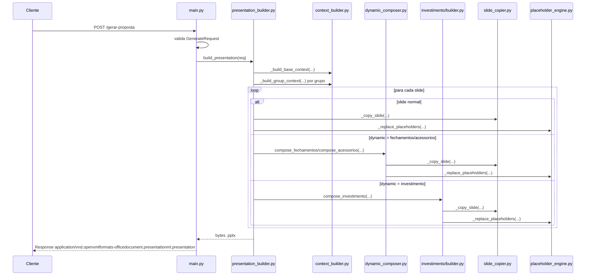

# POST /gerar-proposta

Rota responsavel por gerar a proposta comercial em formato `.pptx`.

Ela recebe um payload JSON com dados globais, grupos de produtos e a lista de slides que devem compor a apresentacao. O servidor monta a apresentacao em memoria, substitui placeholders nos templates PowerPoint e retorna os bytes do arquivo final.

---

## 1. Contrato HTTP

| Item | Valor |
|---|---|
| Metodo | `POST` |
| Rota | `/gerar-proposta` |
| Handler | `gerar_proposta(req: GenerateRequest)` |
| Entrada | `application/json` |
| Saida | arquivo `.pptx` em bytes |
| Media type de resposta | `application/vnd.openxmlformats-officedocument.presentationml.presentation` |
| Header de download | `Content-Disposition: attachment; filename="proposta.pptx"` |

Referencia principal:

| Arquivo | Linhas | Funcao/trecho |
|---|---:|---|
| `main.py` | `90-108` | Declaracao da rota e handler `gerar_proposta`. |

---

## 2. Modelos de Entrada

FastAPI valida o body da requisicao usando modelos Pydantic definidos em `main.py`.

| Modelo | Arquivo | Linhas | Papel |
|---|---|---:|---|
| `ProductGroupRequest` | `main.py` | `62-68` | Define um grupo de produto da proposta. |
| `SlideEntryRequest` | `main.py` | `71-75` | Define um slide solicitado no formato rico. |
| `GenerateRequest` | `main.py` | `78-82` | Define o payload completo aceito pela rota. |

### `GenerateRequest`

```python
class GenerateRequest(BaseModel):
    slides: list[SlideEntryRequest] | None = None
    slideIds: list[str] | None = None
    globalValues: dict[str, Any]
    productGroups: list[ProductGroupRequest]
```

O servidor aceita dois formatos:

| Formato | Campo usado | Status | Observacao |
|---|---|---|---|
| Rico | `slides` | Atual | Recomendado. Permite `templateFile`, `dynamic` e `groupIndex`. |
| Legado | `slideIds` | Compatibilidade | Mantido para clientes antigos. Nao e recomendado para propostas multi-produto. |

---

## 3. Visao Geral da Execucao

Fluxo de alto nivel:

```text
Cliente HTTP
  |
  v
FastAPI / middleware de log
  |
  v
main.py::gerar_proposta(req)
  |
  v
slide_merger.py -> presentation_builder.py::build_presentation(req)
  |
  +-- context_builder.py
  |     cria contexto global e contextos por produto
  |
  +-- para cada slide solicitado
  |     +-- slide estatico
  |     +-- dynamic="fechamentos"
  |     +-- dynamic="acessorios"
  |     +-- dynamic="investimento"
  |
  v
Presentation.save(BytesIO)
  |
  v
main.py retorna Response com bytes .pptx
```

---

## 4. Mapa de Execucao com Referencias

Esta tabela lista os pontos de codigo executados quando a rota e chamada.

| Ordem | Arquivo | Linhas | Funcao/trecho | Quando executa |
|---:|---|---:|---|---|
| 1 | `main.py` | `35-49` | `log_requests` | Toda requisicao HTTP passa pelo middleware. |
| 2 | `main.py` | `62-82` | Modelos Pydantic | Antes do handler, FastAPI valida o payload. |
| 3 | `main.py` | `90-108` | `gerar_proposta` | Handler da rota. |
| 4 | `slide_merger.py` | `1-4` | shim de compatibilidade | `main.py` importa `build_presentation` por este modulo. |
| 5 | `presentation_builder.py` | `89-183` | `build_presentation` | Orquestracao principal da geracao. |
| 6 | `context_builder.py` | `167-189` | `_build_base_context` | Cria contexto global. |
| 7 | `context_builder.py` | `192-353` | `_build_group_context` | Cria contexto por grupo de produto. |
| 8 | `presentation_builder.py` | `99-104` | `_ctx_for` | Seleciona o contexto correto para cada slide. |
| 9 | `presentation_builder.py` | `110-161` | fluxo rico `req.slides` | Executa quando o payload possui `slides`. |
| 10 | `presentation_builder.py` | `162-169` | fluxo legado `slideIds` | Executa quando `slides` e ausente. |
| 11 | `presentation_builder.py` | `171-183` | gravacao final | Salva o `.pptx` em memoria e retorna bytes. |
| 12 | `main.py` | `103-108` | `Response(...)` | Encapsula os bytes no retorno HTTP. |

Em caso de erro nao tratado:

| Arquivo | Linhas | Funcao |
|---|---:|---|
| `main.py` | `52-59` | `unhandled_exception_handler` |

---

## 5. Handler HTTP

Referencia:

| Arquivo | Linhas |
|---|---:|
| `main.py` | `90-108` |

Fluxo dentro de `gerar_proposta`:

1. Recebe `req: GenerateRequest`.
2. Verifica se o payload usa o formato rico:

```python
use_rich = req.slides is not None
```

3. Registra log `generate_request` com:

| Campo de log | Valor |
|---|---|
| `slide_count` | Quantidade de slides recebidos. |
| `format` | `"rich"` quando `slides` existe; `"legacy"` quando usa `slideIds`. |

4. Chama:

```python
pptx_bytes = build_presentation(req)
```

5. Registra log `generate_response` com `size_bytes`.
6. Retorna `Response` com o arquivo `.pptx`.

---

## 6. Import via `slide_merger.py`

Referencia:

| Arquivo | Linhas |
|---|---:|
| `slide_merger.py` | `1-4` |

`main.py` importa `build_presentation` de `slide_merger.py`, mas esse arquivo e apenas um shim de compatibilidade:

```python
from presentation_builder import build_presentation
from slide_registry import get_available_slides, is_slide_available
```

A implementacao real da geracao esta em `presentation_builder.py`.

---

## 7. Orquestracao Principal: `build_presentation`

Referencia:

| Arquivo | Linhas |
|---|---:|
| `presentation_builder.py` | `89-183` |

Responsabilidades de `build_presentation`:

1. Identificar se o request usa `slides` ou `slideIds`.
2. Construir contextos de placeholders.
3. Criar uma apresentacao vazia com dimensoes padronizadas.
4. Iterar pelos slides solicitados na ordem recebida.
5. Delegar slides dinamicos para compositores especificos.
6. Copiar templates estaticos quando aplicavel.
7. Salvar o resultado em `BytesIO`.
8. Retornar os bytes finais.

Trecho inicial relevante:

```python
use_rich_slides = hasattr(req, 'slides') and req.slides is not None
base_ctx = _build_base_context(req.globalValues, req.productGroups)
group_ctxs = [_build_group_context(g) for g in req.productGroups]
single_group = len(req.productGroups) == 1
groups_by_index = {i: g for i, g in enumerate(req.productGroups)}
img_counter = [0]
```

### `img_counter`

`img_counter` e uma lista mutavel usada durante a copia de slides para gerar nomes unicos de imagens dentro do pacote `.pptx`. Por ser criado dentro de `build_presentation`, ele e isolado por requisicao.

---

## 8. Construcao de Contexto

### Contexto Global

Referencia:

| Arquivo | Linhas | Funcao |
|---|---:|---|
| `context_builder.py` | `167-189` | `_build_base_context` |

Cria valores globais usados por slides como capa, dados do cliente, sumario e rodapes.

Campos importantes:

| Placeholder | Origem |
|---|---|
| `nome_razao_social` | `globalValues.nome_razao_social` |
| `nome_contato` | `globalValues.nome_contato` |
| `endereco_cliente` | `globalValues.endereco_cliente` |
| `local_obra` | `globalValues.local_obra` |
| `telefone` | `globalValues.telefone` |
| `email` | `globalValues.email` |
| `numero_proposta` | `globalValues.numero_proposta` |
| `np` | alias de `numero_proposta` |
| `data_solicitacao` | data formatada para `DD/MM/YYYY` |
| `ds` | alias de `data_solicitacao` |
| `data_envio` | data formatada para `DD/MM/YYYY` |
| `de` | alias de `data_envio` |
| `tipo_doc` | derivado de `cpf_cnpj` |
| `n_doc` | documento formatado |
| `sumario` | texto do produto ou lista numerada em propostas multi-produto |

Helpers usados:

| Arquivo | Linhas | Funcao | Papel |
|---|---:|---|---|
| `context_builder.py` | `55-59` | `_fmt_date` | Converte `YYYY-MM-DD` para `DD/MM/YYYY`. |
| `context_builder.py` | `62-73` | `_doc_parts` | Detecta CPF/CNPJ e aplica mascara. |

### Contexto por Produto

Referencia:

| Arquivo | Linhas | Funcao |
|---|---:|---|
| `context_builder.py` | `192-353` | `_build_group_context` |

Cria valores especificos de cada `productGroup`.

Primeiro, todas as chaves de `group.values` sao copiadas para o contexto como strings:

```python
ctx.update({k: str(v) if v is not None else "" for k, v in values.items()})
```

Depois, o backend adiciona valores calculados e descricoes comerciais.

Exemplos de placeholders derivados:

| Placeholder | Regra |
|---|---|
| `dimensoes_portoes` | Combina altura e comprimento dos portoes. |
| `travamento_descricao` | Gera frase a partir da lista `travamento`. |
| `alambrado_descricao` | Gera frase comercial do sistema de alambrado. |
| `descricao_alambrado` | Alias de `alambrado_descricao`. |
| `descricao_tela_sombreamento` | Gera frase comercial da tela de sombreamento. |
| `tela_sombreamento_descricao` | Alias de `descricao_tela_sombreamento`. |
| `quantity` | Quantidade formatada. |
| `area_total_fmt` | Area formatada com virgula decimal. |
| `area_alambrado` | Area calculada do alambrado. |
| `qtde_iluminacao` | `1,00` quando possui iluminacao; senao `—`. |
| `area_playcushion` | Area quando possui PlayCushion; senao `—`. |
| `sistema_alambrado` | Label comercial do sistema. |
| `sistema_alabrado` | Alias com typo mantido por compatibilidade. |
| `qtde_eva` | Perimetro calculado quando possui EVA. |
| `espessura_total` | Soma SBR + EPDM para `softplay`. |

Helpers de produto relevantes:

| Arquivo | Linhas | Funcao | Papel |
|---|---:|---|---|
| `context_builder.py` | `42-52` | `_is_truthy` | Normaliza booleanos e strings. |
| `context_builder.py` | `76-80` | `_fmt_dimension` | Formata medidas em metros. |
| `context_builder.py` | `83-87` | `_fmt_numero` | Formata numeros com virgula decimal. |
| `context_builder.py` | `90-114` | `_fmt_alambrado_descricao` | Gera descricao do alambrado. |
| `context_builder.py` | `117-146` | `_fmt_tela_sombreamento_descricao` | Gera descricao da tela de sombreamento. |
| `context_builder.py` | `149-164` | `_fmt_travamento` | Gera descricao de travamento. |

### Selecao de Contexto por Slide

Referencia:

| Arquivo | Linhas |
|---|---:|
| `presentation_builder.py` | `99-104` |

Funcao interna:

```python
def _ctx_for(group_idx):
    if group_idx is not None and group_idx < len(group_ctxs):
        return {**base_ctx, **group_ctxs[group_idx]}
    if single_group:
        return {**base_ctx, **group_ctxs[0]}
    return base_ctx
```

Regras:

| Caso | Contexto usado |
|---|---|
| Slide com `groupIndex` valido | `base_ctx + group_ctxs[groupIndex]` |
| Proposta com apenas 1 grupo e slide sem `groupIndex` | `base_ctx + group_ctxs[0]` |
| Proposta multi-produto e slide sem `groupIndex` | apenas `base_ctx` |

---

## 9. Fluxo Rico: `slides`

Referencia:

| Arquivo | Linhas |
|---|---:|
| `presentation_builder.py` | `110-161` |

Quando `req.slides` existe, o backend percorre a lista na ordem enviada pelo frontend.

Para cada item:

```python
slide_id = slide_entry.slideId
dynamic = slide_entry.dynamic
group_idx = slide_entry.groupIndex
ctx = _ctx_for(group_idx)
```

Depois escolhe um dos branches:

| Branch | Linhas | Condicao |
|---|---:|---|
| Fechamentos | `117-123` | `dynamic == "fechamentos"` |
| Acessorios | `124-130` | `dynamic == "acessorios"` |
| Investimento | `131-154` | `dynamic == "investimento"` |
| Slide normal | `155-161` | qualquer outro valor de `dynamic` |

---

## 10. Branch: Slide Normal

Referencia:

| Arquivo | Linhas | Funcao/trecho |
|---|---:|---|
| `presentation_builder.py` | `155-161` | branch de slide normal |
| `presentation_builder.py` | `61-75` | `_add_from_file_with_replacement` |
| `presentation_builder.py` | `78-86` | `_add_placeholder_slide` |

Fluxo:

1. Remove o prefixo `slides/` de `templateFile`.
2. Resolve o caminho real dentro de `SLIDES_DIR`.
3. Se o arquivo existe, chama `_add_from_file_with_replacement`.
4. Se o arquivo nao existe, adiciona um slide de fallback com `[Template pendente: <slideId>]`.

### `_add_from_file_with_replacement`

Referencia:

| Arquivo | Linhas |
|---|---:|
| `presentation_builder.py` | `61-75` |

Executa:

1. Abre o arquivo `.pptx` com `Presentation(file_path)`.
2. Para cada slide no template:
   - copia o slide com `_copy_slide`;
   - remove secoes condicionais, se o `label` estiver em `CONDITIONAL_SECTIONS`;
   - substitui placeholders com `_replace_placeholders`.
3. Registra log `slide_loaded`.

### `_add_placeholder_slide`

Referencia:

| Arquivo | Linhas |
|---|---:|
| `presentation_builder.py` | `78-86` |

Cria um slide simples com texto vermelho indicando que o template esta pendente.

---

## 11. Branch: `dynamic == "fechamentos"`

Referencia da chamada:

| Arquivo | Linhas |
|---|---:|
| `presentation_builder.py` | `117-123` |

Implementacao:

| Arquivo | Linhas | Funcao |
|---|---:|---|
| `dynamic_composer.py` | `60-119` | `compose_fechamentos` |

Configuracao de secoes:

| Arquivo | Linhas |
|---|---:|
| `dynamic_composer.py` | `20-25` |

Mapeamento:

| Flag em `values` | Secao inserida |
|---|---|
| `possui_alambrado` | `secao_alambrado.pptx` |
| `possui_iluminacao` | `secao_iluminacao.pptx` |
| `possui_tela_superior` | `secao_tela_superior.pptx` |
| `possui_tela_sombreamento` | `secao_tela_sombreamento.pptx` |

Fluxo:

1. Deriva `product_id` removendo o prefixo `fechamentos_` de `slideId`.
2. Busca o grupo por `groupIndex`.
3. Copia `group.values`.
4. Resolve `base_path` a partir de `templateFile`.
5. Chama `compose_fechamentos`.

Dentro de `compose_fechamentos`:

1. Calcula as secoes ativas com `_is_truthy`.
2. Se nao houver secoes:
   - para `padel`, ainda renderiza o slide base;
   - para os demais produtos, retorna sem adicionar slide.
3. Se houver ate 3 secoes, monta uma pagina.
4. Se houver 4 secoes, divide em 2 paginas.
5. Para cada pagina:
   - abre o slide base;
   - copia o slide base para a apresentacao final;
   - abre cada componente `secao_*.pptx`;
   - copia os shapes do componente;
   - desloca verticalmente os shapes com `_shift_shape_top`;
   - substitui placeholders.

Resolucao de componentes:

| Arquivo | Funcao |
|---|---|
| `slide_registry.py` | `_resolve_slide_path` |

O resolvedor tenta primeiro o arquivo especifico do produto. Se nao existir, usa o arquivo de mesmo nome em `slides/_comum/`.

---

## 12. Branch: `dynamic == "acessorios"`

Referencia da chamada:

| Arquivo | Linhas |
|---|---:|
| `presentation_builder.py` | `124-130` |

Implementacao:

| Arquivo | Linhas | Funcao |
|---|---:|---|
| `dynamic_composer.py` | `122-167` | `compose_acessorios` |

Selecao de secoes:

| Arquivo | Linhas | Funcao |
|---|---:|---|
| `dynamic_composer.py` | `28-57` | `_get_active_acessorios_sections` |

Regras por produto:

| Produto | Regra |
|---|---|
| `padel` | Adiciona `padel` quando `possui_acessorio_padel` e verdadeiro. |
| `pickleball` | Adiciona `pickleball` quando `possui_rede_pickleball` e verdadeiro. |
| demais, principalmente `quadra_poliesportiva` | Avalia basquete adulto, basquete juvenil, volei, tenis e futsal. |

Fluxo:

1. Deriva `product_id` removendo `acessorios_` do `slideId`.
2. Busca `group` por `groupIndex`.
3. Resolve `base_path`.
4. Chama `compose_acessorios`.
5. `compose_acessorios` calcula secoes ativas.
6. Se nao houver secoes, retorna sem adicionar slide.
7. Agrupa secoes em paginas de ate 4 itens.
8. Para cada pagina:
   - abre `acessorios_base.pptx`;
   - copia o slide base;
   - abre cada `secao_acessorio_*.pptx`;
   - insere os shapes deslocados verticalmente;
   - substitui placeholders.

---

## 13. Branch: `dynamic == "investimento"`

Referencia da chamada:

| Arquivo | Linhas |
|---|---:|
| `presentation_builder.py` | `131-154` |

Implementacao principal:

| Arquivo | Linhas | Funcao |
|---|---:|---|
| `investimento/builder.py` | `48-89` | `compose_investimento` |

Fluxo no branch:

1. Busca `group` por `groupIndex`.
2. Se o grupo nao existir, adiciona slide de placeholder e continua.
3. Copia `group.values`.
4. Injeta `values["_quantity"] = group.quantity`.
5. Usa sempre `slides/global/investimento_base.pptx` como base dinamica.
6. Chama `compose_investimento`.
7. Se `compose_investimento` levantar `NotImplementedError`, tenta cair para o template legado informado no request.

### `compose_investimento`

Referencia:

| Arquivo | Linhas |
|---|---:|
| `investimento/builder.py` | `48-89` |

Executa:

1. Verifica se `investimento_base.pptx` existe.
2. Busca os itens comerciais aplicaveis:

```python
items = get_items(product_id, variant_id, values)
```

3. Abre o template base.
4. Copia o slide base para a apresentacao final.
5. Localiza e remove a ancora `{{tabela_investimento}}`.
6. Substitui placeholders restantes.
7. Se nao houver itens aplicaveis, retorna mantendo apenas o slide base.
8. Cria tabela com:
   - cabecalho;
   - linhas de itens;
   - linha de valor total;
   - larguras, alturas, bordas, cores e fontes.

### Ancora da Tabela

Referencia:

| Arquivo | Linhas | Funcao |
|---|---:|---|
| `investimento/builder.py` | `94-104` | `_find_and_remove_anchor` |

O template base precisa conter exatamente:

```text
{{tabela_investimento}}
```

A posicao e tamanho desse shape viram a posicao e tamanho da tabela gerada.

### Montagem da Tabela

| Arquivo | Linhas | Funcao | Papel |
|---|---:|---|---|
| `investimento/builder.py` | `107-121` | `_apply_row_heights` | Define altura de cabecalho, corpo e total. |
| `investimento/builder.py` | `124-129` | `_apply_column_widths` | Define largura das quatro colunas. |
| `investimento/builder.py` | `177-186` | `_build_header_row` | Cria cabecalho. |
| `investimento/builder.py` | `189-224` | `_build_item_row` | Cria cada linha de item. |
| `investimento/builder.py` | `227-242` | `_build_total_row` | Cria linha final `VALOR TOTAL`. |
| `investimento/builder.py` | `165-174` | `_apply_table_borders` | Aplica bordas externas e horizontais. |

---

## 14. Fluxo Legado: `slideIds`

Referencia:

| Arquivo | Linhas |
|---|---:|
| `presentation_builder.py` | `162-169` |

Contexto legado:

| Arquivo | Linhas | Funcao |
|---|---:|---|
| `context_builder.py` | `356-360` | `_build_context` |

Fluxo:

1. Cria `legacy_ctx` chamando `_build_context`.
2. Itera por `req.slideIds`.
3. Resolve cada `slide_id` usando `_slide_template_path`.
4. Se o arquivo existe, chama `_add_from_file_with_replacement`.
5. Se nao existe, adiciona slide de placeholder.

Limitacao importante:

`_build_context` junta todos os grupos em um unico dicionario plano. Em propostas multi-produto, valores de grupos posteriores podem sobrescrever valores de grupos anteriores. Por isso, o formato legado nao deve ser usado para propostas multi-produto.

---

## 15. Copia de Slides

Referencia:

| Arquivo | Linhas | Funcao |
|---|---:|---|
| `slide_copier.py` | `42-70` | `_copy_slide` |
| `slide_copier.py` | `27-39` | `_copy_background` |
| `slide_copier.py` | `12-24` | `_shift_shape_top` |

### `_copy_slide`

Responsavel por copiar um slide de um template para a apresentacao final.

Passos principais:

1. Cria um slide novo usando layout em branco.
2. Percorre relacoes do slide de origem.
3. Para cada imagem:
   - incrementa `img_counter`;
   - cria um novo `ImagePart`;
   - relaciona a imagem ao slide novo;
   - guarda o mapa de `rId` antigo para `rId` novo.
4. Faz `deepcopy` da arvore XML de shapes.
5. Atualiza referencias `r:embed` para os novos `rId`s.
6. Substitui a arvore de shapes do slide novo.
7. Copia o background.

### `_shift_shape_top`

Usada pelos compositores dinamicos para deslocar verticalmente os shapes copiados de secoes.

---

## 16. Substituicao de Placeholders

Referencia:

| Arquivo | Linhas | Funcao |
|---|---:|---|
| `placeholder_engine.py` | `13-22` | `_replace_placeholders` |
| `placeholder_engine.py` | `25-50` | `_replace_in_paragraph` |
| `placeholder_engine.py` | `10` | regex `_PLACEHOLDER_RE` |

Formato aceito:

```text
{{ chave }}
{{chave}}
```

Regex:

```python
r"\{\{\s*([A-Za-z_][A-Za-z0-9_]*)\s*\}\}"
```

O motor percorre:

- shapes com `text_frame`;
- paragrafos;
- tabelas;
- celulas de tabelas;
- paragrafos dentro das celulas.

Comportamento:

| Caso | Resultado |
|---|---|
| Placeholder existe no contexto | Substitui pelo valor. |
| Placeholder nao existe no contexto | Mantem o texto original no `.pptx`. |
| Paragrafo tem varios runs | Junta o texto, substitui e grava no primeiro run. |
| Placeholder `sumario` | Reseta a cor do primeiro run para preto. |

Observacao: como a substituicao grava o texto resultante no primeiro run, templates com estilos diferentes dentro do mesmo placeholder podem perder parte da formatacao original.

---

## 17. Saida da Apresentacao

Referencia:

| Arquivo | Linhas |
|---|---:|
| `presentation_builder.py` | `171-183` |
| `main.py` | `103-108` |

`build_presentation` salva a apresentacao em memoria:

```python
output = BytesIO()
merged.save(output)
result = output.getvalue()
```

Depois registra log `presentation_built` com:

| Campo | Descricao |
|---|---|
| `slide_count` | Quantidade de slides finais. |
| `size_bytes` | Tamanho do arquivo gerado. |
| `duration_ms` | Tempo total da montagem. |

O handler retorna:

```python
return Response(
    content=pptx_bytes,
    media_type="application/vnd.openxmlformats-officedocument.presentationml.presentation",
    headers={"Content-Disposition": 'attachment; filename="proposta.pptx"'},
)
```

---

## 18. Logs

| Log | Arquivo | Linhas | Quando ocorre |
|---|---|---:|---|
| `generate_request` | `main.py` | `93-99` | Antes de iniciar a geracao. |
| `slide_loaded` | `presentation_builder.py` | `75` | Apos carregar slide estatico de template. |
| `presentation_built` | `presentation_builder.py` | `175-182` | Apos salvar a apresentacao em memoria. |
| `generate_response` | `main.py` | `103` | Antes de retornar a resposta HTTP. |
| `request` | `main.py` | `40-48` | No middleware, apos a rota responder. |

Warnings relevantes:

| Origem | Condicao |
|---|---|
| `dynamic_composer.py::compose_fechamentos` | `fechamentos_base` ou componente `secao_*.pptx` ausente. |
| `dynamic_composer.py::compose_acessorios` | `acessorios_base` ou componente `secao_acessorio_*.pptx` ausente. |
| `investimento/builder.py::compose_investimento` | `investimento_base` ausente ou ancora nao encontrada. |

---

## 19. Erros e Fallbacks

| Cenario | Comportamento |
|---|---|
| JSON invalido ou schema incompativel | FastAPI/Pydantic retorna `422`. |
| Excecao nao tratada | `unhandled_exception_handler` retorna `500 {"error": "internal_server_error"}`. |
| Template normal ausente | Adiciona slide `[Template pendente: <slideId>]`. |
| Componente dinamico ausente | Registra warning e continua sem aquele componente. |
| `fechamentos` sem secoes ativas | Nao adiciona slide, exceto para `padel`. |
| `acessorios` sem secoes ativas | Nao adiciona slide. |
| Catalogo de investimento nao implementado | Tenta usar template legado informado no request. |
| Ancora `{{tabela_investimento}}` ausente | Mantem slide base, substitui placeholders e nao cria tabela. |
| Placeholder desconhecido | Permanece no PowerPoint final. |

---

## 20. Exemplo de Payload

```json
{
  "slides": [
    {
      "slideId": "capa",
      "templateFile": "slides/global/capa.pptx"
    },
    {
      "slideId": "dados_cliente",
      "templateFile": "slides/global/dados_cliente.pptx"
    },
    {
      "slideId": "fechamentos_quadra_tenis",
      "templateFile": "slides/_comum/fechamentos_base.pptx",
      "dynamic": "fechamentos",
      "groupIndex": 0
    },
    {
      "slideId": "investimento_piso_asfaltico_quadra_tenis",
      "templateFile": "slides/global/investimento_base.pptx",
      "dynamic": "investimento",
      "groupIndex": 0
    }
  ],
  "globalValues": {
    "nome_razao_social": "Condominio Exemplo",
    "nome_contato": "Maria Silva",
    "cpf_cnpj": "12345678000199",
    "endereco_cliente": "Rua Exemplo, 100",
    "local_obra": "Sao Paulo, SP",
    "telefone": "(11) 99999-9999",
    "email": "maria@exemplo.com",
    "numero_proposta": "P-2026-001",
    "data_solicitacao": "2026-05-01",
    "data_envio": "2026-05-20"
  },
  "productGroups": [
    {
      "productId": "quadra_tenis",
      "quantity": 1,
      "variantId": "piso_asfaltico",
      "values": {
        "largura": 10.97,
        "comprimento": 23.77,
        "area_total": 260.66,
        "possui_playcushion": true,
        "possui_alambrado": true,
        "sistema_alambrado": "gaiola",
        "altura_alambrado_fundos": 4.0,
        "comprimento_alambrado_laterais": 23.77,
        "altura_alambrado_laterais": 4.0,
        "comprimento_alambrado_fundos": 10.97,
        "galvanizacao": "fogo",
        "possui_iluminacao": false,
        "possui_tela_superior": false,
        "possui_tela_sombreamento": false,
        "travamento": ["travamento_superior", "travamento_inferior"]
      },
      "sumarioText": "Quadra de Tenis - Piso Asfaltico com PlayCushion",
      "investimentoRows": []
    }
  ]
}
```

Execucao esperada para esse payload:

1. `capa` e tratado como slide normal.
2. `dados_cliente` e tratado como slide normal.
3. `fechamentos_quadra_tenis` entra no branch `dynamic == "fechamentos"`.
4. Como `possui_alambrado` e verdadeiro, o compositor tenta inserir `secao_alambrado.pptx`.
5. `investimento_piso_asfaltico_quadra_tenis` entra no branch `dynamic == "investimento"`.
6. A tabela de investimento e gerada a partir do catalogo de `quadra_tenis` e variante `piso_asfaltico`.

---

## 21. Diagrama de Sequencia



---

## 22. Checklist de Manutencao da Rota

Ao alterar esta rota ou funcoes chamadas por ela, verificar:

1. O payload continua validando em `GenerateRequest`.
2. Slides multi-produto continuam usando `groupIndex`.
3. Placeholders globais continuam vindo de `_build_base_context`.
4. Placeholders de produto continuam isolados por `_build_group_context`.
5. Slides normais ainda caem em `_add_from_file_with_replacement`.
6. Fechamentos ainda respeitam flags em `_FECHAMENTOS_SECTIONS`.
7. Acessorios ainda respeitam `_get_active_acessorios_sections`.
8. Investimento ainda encontra `{{tabela_investimento}}`.
9. Templates ausentes continuam gerando fallback controlado.
10. `pytest tests/ -v` continua passando.
